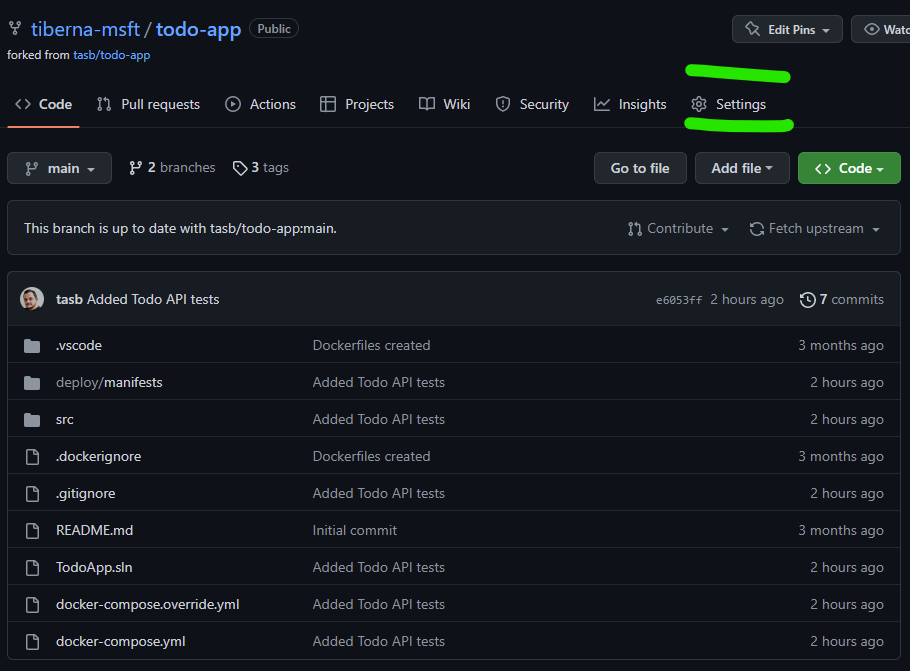
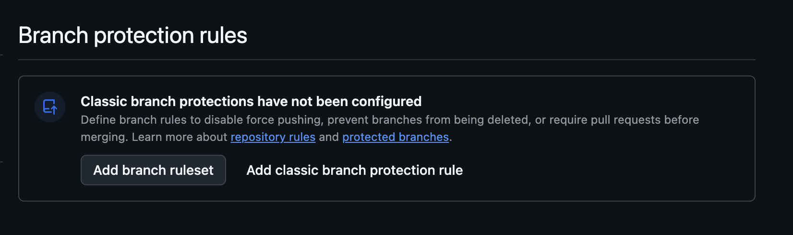
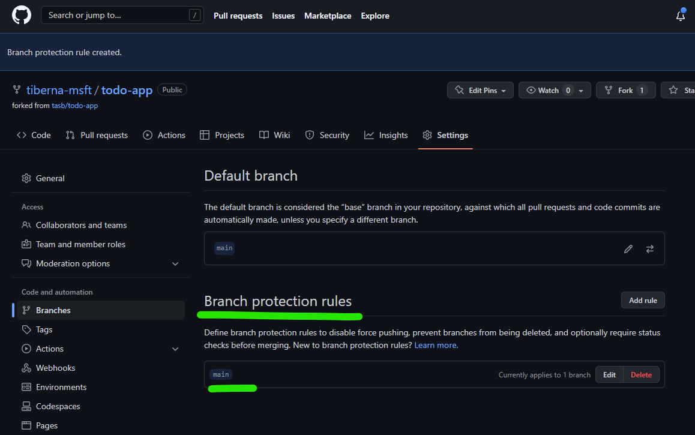

# Lab 10 - Terraform in CI/CD

> Consolidates **Session 10 — Terraform in CI/CD**: security scanning with Checkov, the
> pull-request workflow, and continuous delivery with a disposable environment,
> approvals and drift. The grand finale — you ship your project through a pipeline.

## Table of Contents

- [Learning Objectives](#learning-objectives)
- [Pre-requisites](#pre-requisites)
- [Part A — Pull-request workflow](#part-a--pull-request-workflow)
  - [Step 01: Configure your repo](#step-01-configure-your-repo)
  - [Step 02: Workload identity with Azure](#step-02-workload-identity-with-azure)
  - [Step 03: Add repository secrets](#step-03-add-repository-secrets)
  - [Step 04: Create the pull-request workflow](#step-04-create-the-pull-request-workflow)
  - [Step 05: Review Checkov &amp; the plan comment](#step-05-review-checkov--the-plan-comment)
- [Part B — Continuous delivery (guided finale)](#part-b--continuous-delivery-guided-finale)
  - [Step 06: Simulate configuration drift](#step-06-simulate-configuration-drift)
  - [Step 07: Create the CI/CD workflow](#step-07-create-the-cicd-workflow)
  - [Step 08: Add a GitHub Environment with approval](#step-08-add-a-github-environment-with-approval)
  - [Step 09: Run the pipeline](#step-09-run-the-pipeline)
- [Conclusion](#conclusion)

## Learning Objectives

- Enforce pull requests with branch protection
- Authenticate GitHub Actions to Azure with secretless OIDC (workload identity federation)
- Scan Terraform with Checkov and post the plan as a PR comment
- Deliver with a disposable test environment, an approval gate, and drift correction

## Pre-requisites

- Have finished [Lab 09](lab09.md) with your modules ready (or use [the Session 09 demo](../demos/session09))
- Your Terraform code is on the `main` branch and uses the Azure backend from Lab 05
- Azure CLI installed and logged in

---

## Part A — Pull-request workflow

### Step 01: Configure your repo

In your repo **Settings**, enable **Issues**, then add a **classic branch protection
rule** for `main`: enable *Require a pull request before merging*, and **disable**
*Required approvals* (you're the only author). Create the rule.





### Step 02: Workload identity with Azure

Create a Service Principal and federate it to GitHub so Actions can reach Azure **without
storing a secret**.

```bash
az login
az ad sp create-for-rbac --name "GitHubActions_<your_name>" \
  --role contributor --scopes /subscriptions/<your-subscription-id>
```

Create `policy_main.json` and `policy_pr.json` (replace `<GH-USERNAME>`/`<GH-REPO>`):

```json
{ "name": "gh-repo-main", "issuer": "https://token.actions.githubusercontent.com",
  "subject": "repo:<GH-USERNAME>/<GH-REPO>:ref:refs/heads/main",
  "audiences": ["api://AzureADTokenExchange"] }
```

```json
{ "name": "gh-repo-pr", "issuer": "https://token.actions.githubusercontent.com",
  "subject": "repo:<GH-USERNAME>/<GH-REPO>:pull_request",
  "audiences": ["api://AzureADTokenExchange"] }
```

```bash
az ad app federated-credential create --id <OBJECT_ID> --parameters @policy_main.json
az ad app federated-credential create --id <OBJECT_ID> --parameters @policy_pr.json
```

### Step 03: Add repository secrets

In **Settings → Secrets and variables → Actions**, add: `AZURE_SUBSCRIPTION_ID`,
`AZURE_TENANT_ID`, `AZURE_CLIENT_ID` (from the SP JSON) and `DB_PASSWORD`.

### Step 04: Create the pull-request workflow

On a new branch, add `.github/workflows/pull_request.yml`:

```yaml
name: Pull Request Workflow
on:
  pull_request:
    branches: [main]
jobs:
  validate-and-scan:
    runs-on: ubuntu-latest
    steps:
      - uses: actions/checkout@v4
      - uses: hashicorp/setup-terraform@v3
        with: { terraform_version: 1.10.2 }
      - run: terraform init
      - run: terraform validate
      - name: Checkov
        continue-on-error: true
        uses: bridgecrewio/checkov-action@v12
        with: { directory: <your_directory> }
  plan:
    runs-on: ubuntu-latest
    needs: validate-and-scan
    permissions: { id-token: write, contents: read }
    steps:
      - uses: actions/checkout@v4
      - uses: hashicorp/setup-terraform@v3
        with: { terraform_version: 1.10.2 }
      - uses: azure/login@v2
        with:
          client-id: ${{ secrets.AZURE_CLIENT_ID }}
          tenant-id: ${{ secrets.AZURE_TENANT_ID }}
          subscription-id: ${{ secrets.AZURE_SUBSCRIPTION_ID }}
      - run: terraform init
      - run: terraform plan -var=db_password=${{ secrets.DB_PASSWORD }} -var=prefix=<your_prefix> -out ./infraPlan
      - name: Post PR comment
        uses: borchero/terraform-plan-comment@v2
        with: { token: ${{ github.token }}, planfile: ./infraPlan }
```

Push the branch and open a pull request — the workflow runs automatically.

### Step 05: Review Checkov &amp; the plan comment

Read the Checkov log: in production you'd fix the findings or skip specific rules — don't
over-tighten and block delivery. Then read the **plan comment** the workflow posts on the
PR: that's your quality gate for deciding whether to merge.

---

## Part B — Continuous delivery (guided finale)

> This part is walked through **instructor-led** at the end of the session. Follow along,
> then replay it in your own repo.

### Step 06: Simulate configuration drift

In the Azure Portal, change something by hand (e.g. delete the frontend App Service or
change the database SKU) to create drift the pipeline will correct.

### Step 07: Create the CI/CD workflow

On a new branch, add `.github/workflows/main.yml` that runs on push to `main` and:

1. **plan-apply-tst** — applies a disposable test copy using `prefix=<prefix>-tst`.
2. **destroy-tst** — destroys it, gated behind a `tst` environment (approval).
3. **plan-apply** — applies the real environment, correcting the drift from Step 06.

```yaml
name: Main Workflow
on:
  push:
    branches: [main]
env:
  PREFIX: <your_prefix>
jobs:
  plan-apply-tst:
    runs-on: ubuntu-latest
    permissions: { id-token: write, contents: read }
    steps:
      - uses: actions/checkout@v4
      - uses: hashicorp/setup-terraform@v3
        with: { terraform_version: 1.10.2 }
      - uses: azure/login@v2
        with:
          client-id: ${{ secrets.AZURE_CLIENT_ID }}
          tenant-id: ${{ secrets.AZURE_TENANT_ID }}
          subscription-id: ${{ secrets.AZURE_SUBSCRIPTION_ID }}
      - run: terraform init
      - run: terraform plan -var=db_password=${{ secrets.DB_PASSWORD }} -var=prefix=${{ env.PREFIX }}-tst -out ./tstPlan
      - run: terraform apply -auto-approve ./tstPlan
  destroy-tst:
    runs-on: ubuntu-latest
    needs: plan-apply-tst
    environment: tst        # approval gate
    permissions: { id-token: write, contents: read }
    steps:
      - uses: actions/checkout@v4
      - uses: hashicorp/setup-terraform@v3
        with: { terraform_version: 1.10.2 }
      - uses: azure/login@v2
        with:
          client-id: ${{ secrets.AZURE_CLIENT_ID }}
          tenant-id: ${{ secrets.AZURE_TENANT_ID }}
          subscription-id: ${{ secrets.AZURE_SUBSCRIPTION_ID }}
      - run: terraform init
      - run: terraform destroy -auto-approve
  plan-apply:
    runs-on: ubuntu-latest
    needs: destroy-tst
    permissions: { id-token: write, contents: read }
    steps:
      - uses: actions/checkout@v4
      - uses: hashicorp/setup-terraform@v3
        with: { terraform_version: 1.10.2 }
      - uses: azure/login@v2
        with:
          client-id: ${{ secrets.AZURE_CLIENT_ID }}
          tenant-id: ${{ secrets.AZURE_TENANT_ID }}
          subscription-id: ${{ secrets.AZURE_SUBSCRIPTION_ID }}
      - run: terraform init
      - run: terraform plan -var=db_password=${{ secrets.DB_PASSWORD }} -var=prefix=${{ env.PREFIX }} -out ./infraPlan
      - run: terraform apply -auto-approve ./infraPlan
```

### Step 08: Add a GitHub Environment with approval

In **Settings → Environments**, create an environment named `tst`, enable **Require
reviewers** and add yourself. The `environment: tst` line on the `destroy-tst` job pauses
the pipeline for your approval — a real CD control.

### Step 09: Run the pipeline

Open a PR for the workflow branch (read the plan comment showing the drift), then merge.
On merge, the CI/CD workflow runs: it spins up the disposable `tst` environment, waits for
your approval to destroy it, then applies the real environment — bringing Azure back in
line with your code.

## Conclusion

You built the full delivery loop: a scanned, reviewed pull request, secretless auth to
Azure, and continuous delivery with a disposable environment, an approval gate and
automatic drift correction. That's Terraform, the way teams actually ship — and the
finish line of the course. Congratulations!
